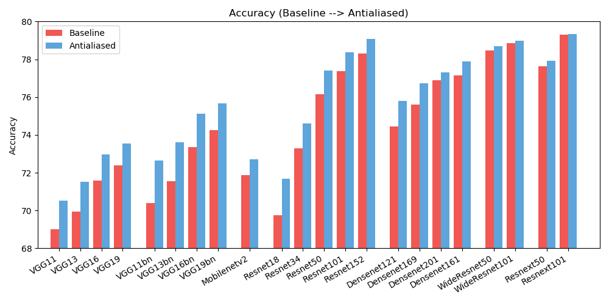
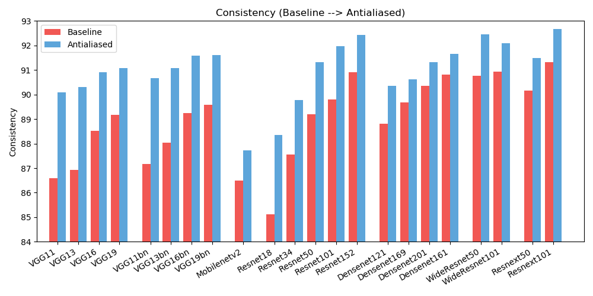

# <b>Antialiased CNNs</b> [[Project Page]](http://richzhang.github.io/antialiased-cnns/) [[Paper]](https://arxiv.org/abs/1904.11486) [[Talk]](https://www.youtube.com/watch?v=HjewNBZz00w)


**Making Convolutional Networks Shift-Invariant Again** <br>
[Richard Zhang](https://richzhang.github.io/). In [ICML, 2019](https://arxiv.org/abs/1904.11486).

### Quick & easy start

Run `pip install antialiased-cnns`

```python
import antialiased_cnns
model = antialiased_cnns.resnet50(pretrained=True) 
```
<!-- model.load_state_dict(torch.load('resnet50_lpf4-994b528f.pth.tar')['state_dict']) # load weights; download it beforehand from https://www.dropbox.com/s/zqsudi0oz5ym8w8/resnet50_lpf4-994b528f.pth.tar?dl=0 -->

<!-- Now you are antialiased! -->

If you have a model already and want to antialias and continue training, copy your old weights over:

``` python
import torchvision.models as models
old_model = models.resnet50(pretrained=True) # old (aliased) model
antialiased_cnns.copy_params_buffers(old_model, model) # copy the weights over
```

If you want to modify your own model, use the BlurPool layer. More information about our provided models and how to use BlurPool is below.

```python
C = 10 # example feature channel size
blurpool = antialiased_cnns.BlurPool(C, stride=2) # BlurPool layer; use to downsample a feature map
ex_tens = torch.Tensor(1,C,128,128)
print(blurpool(ex_tens).shape) # 1xCx64x64 tensor
```

**Updates**
* **(Oct 2020) Finetune** I initialize the antialiased model with weights from baseline model, and finetune. Before, I was training from scratch. The results are better.
* **(Oct 2020) Additional models** We now have 23 total model variants. I added variants of vgg, densenet, resnext, wide resnet varieties! The same conclusions hold.
* **(Sept 2020) Pip install** You can also now `pip install antialiased-cnns` and load models with the `pretrained=True` flag.
* **(Sept 2020) Kernel 4** I have added kernel size 4 experiments. When downsampling an even sized feature map (e.g., a 128x128-->64x64), this is actually the correct size to use to keep the indices from drifting.

### Table of contents

1. [More information about antialiased models](#1-more-information-loading-an-antialiased-model)<br>
2. [Instructions for antialiasing your own model](#2-more-information-how-to-antialias-your-own-architecture), using the [`BlurPool`](antialiased_cnns/__init__.py) layer<br>
3. [ImageNet training and evaluation code](README_IMAGENET.md). Achieving better consistency, while maintaining or improving accuracy, is an open problem. Help improve the results!

## (0) Preliminaries

Pip install this package

- `pip install antialiased-cnns`

Or clone this repository and install requirements (notably, PyTorch)

```bash

https://github.com/adobe/antialiased-cnns.git
cd antialiased-cnns
pip install -r requirements.txt
```


## (1) Loading an antialiased model

The following loads a pretrained antialiased model, perhaps as a backbone for your application.

```python
import antialiased_cnns
model = antialiased_cnns.resnet50(pretrained=True, filter_size=4)
```

We also provide weights for antialiased `AlexNet`, `VGG16(bn)`, `Resnet18,34,50,101`, `Densenet121`, and `MobileNetv2` (see [example_usage.py](example_usage.py)).

## (2) How to antialias your own architecture

The `antialiased_cnns` module contains the `BlurPool` [class](antialiased_cnns/downsample.py), which does blur+subsampling. Run `pip install antialiased-cnns` or copy the `antialiased_cnns` subdirectory.

**Methodology** The methodology is simple -- first evaluate with stride 1, and then use our `BlurPool` layer to do antialiased downsampling. Make the following architectural changes.

```python
import antialiased_cnns

# MaxPool --> MaxBlurPool
baseline = nn.MaxPool2d(kernel_size=2, stride=2)
antialiased = [nn.MaxPool2d(kernel_size=2, stride=1), 
    antialiased_cnns.BlurPool(C, stride=2)]
    
# Conv --> ConvBlurPool
baseline = [nn.Conv2d(Cin, C, kernel_size=3, stride=2, padding=1), 
    nn.ReLU(inplace=True)]
antialiased = [nn.Conv2d(Cin, C, kernel_size=3, stride=1, padding=1),
    nn.ReLU(inplace=True),
    antialiased_cnns.BlurPool(C, stride=2)]

# AvgPool --> BlurPool
baseline = nn.AvgPool2d(kernel_size=2, stride=2)
antialiased = antialiased_cnns.BlurPool(C, stride=2)
```

We assume incoming tensor has `C` channels. Computing a layer at stride 1 instead of stride 2 adds memory and run-time. As such, we typically skip antialiasing at the highest-resolution (early in the network), to prevent large increases.

**Add antialiasing and then continue training** If you already trained a model, and then add antialiasing, you can fine-tune from that old model:

``` python
antialiased_cnns.copy_params_buffers(old_model, antialiased_model)
```

If this doesn't work, you can just copy the parameters (and not buffers). Adding antialiasing doesn't add any parameters, so the parameter lists are identical. (It does add buffers, so some heuristic is used to match the buffers, which may throw an error.)

``` python
antialiased_cnns.copy_params(old_model, antialiased_model)
```

<br>

## (3) ImageNet Evaluation, Results, and Training code

We observe improvements in both **accuracy** (how often the image is classified correctly) and **consistency** (how often two shifts of the same image are classified the same).





| ACCURACY | Baseline | Antialiased | Delta |
| :------: | :------: | :-------: | :-------: |
| alexnet | 56.55 | 56.94 | +0.39 |
| vgg11 | 69.02 | 70.51 | +1.49 |
| vgg13 | 69.93 | 71.52 | +1.59 |
| vgg16 | 71.59 | 72.96 | +1.37 |
| vgg19 | 72.38 | 73.54 | +1.16 |
| vgg11_bn | 70.38 | 72.63 | +2.25 |
| vgg13_bn | 71.55 | 73.61 | +2.06 |
| vgg16_bn | 73.36 | 75.13 | +1.77 |
| vgg19_bn | 74.24 | 75.68 | +1.44 |
| resnet18 | 69.74 | 71.67 | +1.93 |
| resnet34 | 73.30 | 74.60 | +1.30 |
| resnet50 | 76.16 | 77.41 | +1.25 |
| resnet101 | 77.37 | 78.38 | +1.01 |
| resnet152 | 78.31 | 79.07 | +0.76 |
| resnext50_32x4d | 77.62 | 77.93 | +0.31 |
| resnext101_32x8d | 79.31 | 79.33 | +0.02 |
| wide_resnet50_2 | 78.47 | 78.70 | +0.23 |
| wide_resnet101_2 | 78.85 | 78.99 | +0.14 |
| densenet121 | 74.43 | 75.79 | +1.36 |
| densenet169 | 75.60 | 76.73 | +1.13 |
| densenet201 | 76.90 | 77.31 | +0.41 |
| densenet161 | 77.14 | 77.88 | +0.74 |
| mobilenet_v2 | 71.88 | 72.72 | +0.84 |

| CONSISTENCY | Baseline | Antialiased | Delta |
| :------: | :------: | :-------: | :-------: |
| alexnet | 78.18 | 83.31 | +5.13 |
| vgg11 | 86.58 | 90.09 | +3.51 |
| vgg13 | 86.92 | 90.31 | +3.39 |
| vgg16 | 88.52 | 90.91 | +2.39 |
| vgg19 | 89.17 | 91.08 | +1.91 |
| vgg11_bn | 87.16 | 90.67 | +3.51 |
| vgg13_bn | 88.03 | 91.09 | +3.06 |
| vgg16_bn | 89.24 | 91.58 | +2.34 |
| vgg19_bn | 89.59 | 91.60 | +2.01 |
| resnet18 | 85.11 | 88.36 | +3.25 |
| resnet34 | 87.56 | 89.77 | +2.21 |
| resnet50 | 89.20 | 91.32 | +2.12 |
| resnet101 | 89.81 | 91.97 | +2.16 |
| resnet152 | 90.92 | 92.42 | +1.50 |
| resnext50_32x4d | 90.17 | 91.48 | +1.31 |
| resnext101_32x8d | 91.33 | 92.67 | +1.34 |
| wide_resnet50_2 | 90.77 | 92.46 | +1.69 |
| wide_resnet101_2 | 90.93 | 92.10 | +1.17 |
| densenet121 | 88.81 | 90.35 | +1.54 |
| densenet169 | 89.68 | 90.61 | +0.93 |
| densenet201 | 90.36 | 91.32 | +0.96 |
| densenet161 | 90.82 | 91.66 | +0.84 |
| mobilenet_v2 | 86.50 | 87.73 | +1.23 |

To reduce clutter, extended results (different filter sizes) are [here](README_IMAGENET.md). Help improve the results!

## Licenses

<a rel="license" href="http://creativecommons.org/licenses/by-nc-sa/4.0/"></a><br />This work is licensed under a <a rel="license" href="http://creativecommons.org/licenses/by-nc-sa/4.0/">Creative Commons Attribution-NonCommercial-ShareAlike 4.0 International License</a>.

All material is made available under [Creative Commons BY-NC-SA 4.0](https://creativecommons.org/licenses/by-nc-sa/4.0/legalcode) license by Adobe Inc. You can **use, redistribute, and adapt** the material for **non-commercial purposes**, as long as you give appropriate credit by **citing our paper** and **indicating any changes** that you've made.

The repository builds off the PyTorch [examples repository](https://github.com/pytorch/examples) and torchvision [models repository](https://github.com/pytorch/vision/tree/master/torchvision/models). These are [BSD-style licensed](https://github.com/pytorch/examples/blob/master/LICENSE).

## Citation, contact

If you find this useful for your research, please consider citing this [bibtex](https://richzhang.github.io/index_files/bibtex_icml2019.txt). Please contact Richard Zhang \<rizhang at adobe dot com\> with any comments or feedback.


